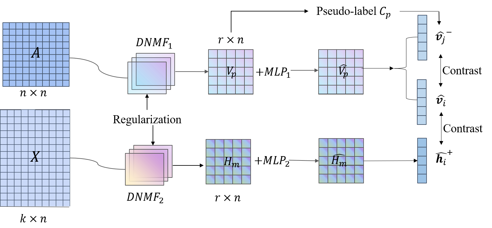
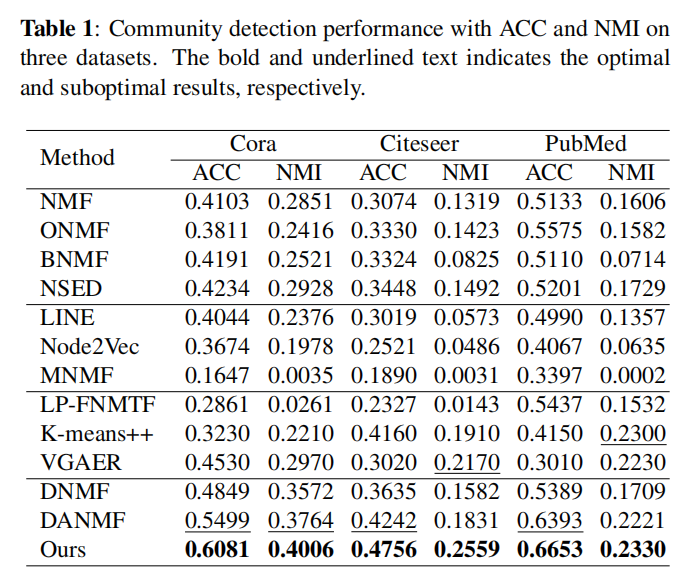
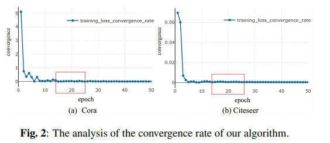

# CDNMF: Contrastive Deep Nonnegative Matrix Factorization for Community Detection (ICASSP 2024)

The implementation of our paper ["Contrastive Deep Nonnegative Matrix Factorization for Community Detection"](https://arxiv.org/abs/2311.02357). (**ICASSP 2024, CCF B**)

**Blog**: [[CN]](https://blog.csdn.net/m0_50826544/article/details/136773553?spm=1011.2415.3001.5331) | [[EN]](https://medium.com/@liych168168/cdnmf-a-trustworthy-and-efficient-community-detection-method-88dc9a6aba2b)

**Wechat Public Platform**: [Paper Reading Note](https://mp.weixin.qq.com/s/3rknZMBeqHW0fNtEvrEA8Q)

**Academic Poster in ICASSP2024 (Korea)**: [Poster](https://github.com/6lyc/CDNMF/blob/main/Poster.pdf)

## Overview

We introduce the idea of contrastive learning (CL) into the nonnegative matrix factorization (NMF) for community detection (CD) **for the first time**, solving the problems of the existing work.

The two modules are mutually reinforcing and naturally coupled: On the one hand, with the help of CL, positive samples are contrasted to allow the NMF to learn **both the graph topological and attribute signals**, while negative samples are contrasted to make the embedding space from NMF more suitable for CD; On the other hand, with the help of NMF's outputs, **more accurate negative samples** can be obtained in CL. Moreover, NMF increases the interpretability of the existing framework.

## Abstract
Recently, nonnegative matrix factorization (NMF) has been widely adopted for community detection, because of its better interpretability. However, the existing NMF-based methods have the following three problems: 1. they directly transform the original network into community membership space, so it is difficult for them to capture the hierarchical information; 2. they often only pay attention to the topology of the network and ignore its node attributes; 3. it is hard for them to learn the global structure information necessary for community detection. Therefore, we propose a new community detection algorithm, named Contrastive Deep Nonnegative Matrix Factorization (CDNMF). Firstly, we deepen NMF to strengthen its capacity for information extraction. Subsequently, inspired by contrastive learning, our algorithm creatively constructs network topology and node attributes as two contrasting views. Furthermore, we utilize a debiased negative sampling layer and learn node similarity at the community level, thereby enhancing the suitability of our model for community detection. We conduct experiments on three public real graph datasets and the proposed model has achieved better results than state-of-the-art methods.

## Requirements
To install the dependencies: `pip install -r requirements.txt`.

## DataSets
The code takes an input graph in a txt file. Sample graphs for the **Cora**, **Citeseer**, **PubMed** and **Wiki** is included in the `Database/` directory.

## Quick Start
Running shell for Cora：    
`python script_cora.py`

Running shell for Citeseer：    
`python script_citeseer.py`

Running shell for PubMed：    
`python script_pubmed.py`

## Community Detection Results and Convergence
Performance on **Cora**, **Citeseer** and **PubMed** (20 runs):  
 

Convergence Rate on **Cora**, **Citeseer**:  

## Citation
Please cite our paper if you use this code or our model in your own work:

@inproceedings{li2024contrastive,  
  title={Contrastive deep nonnegative matrix factorization for community detection},  
  author={Li, Yuecheng and Chen, Jialong and Chen, Chuan and Yang, Lei and Zheng, Zibin},  
  booktitle={ICASSP 2024-2024 IEEE International Conference on Acoustics, Speech and Signal Processing (ICASSP)},  
  pages={6725--6729},  
  year={2024},  
  organization={IEEE}  
}

